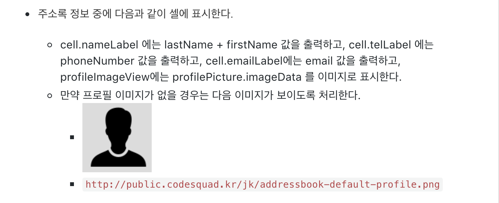

# swift-addressbookapp


### Step 1




* **Contact 프레임워크** 이용하여 주소록 데이터 가져오기
* 주소록 접근을 앱에서 허용하기 위해 info.plist수정으로 권한 얻기
* `CNContact` 정보 중 원하는 정보의 Formatting하기


**주소록 데이터 가져오기 위해 접근권한 허용**


 App에서 주소록 데이터에 접근하기 위해, Info.plist 파일의 다음과 같은 파일 추가가 필요하다.


**TableView 데이터 reloading해주기**

 이번 Step에서는 `TableViewController`를 이용하여 `TableView`를 디자인해주었다. 이전에 `UIViewController`를 이용했던 것과는 다르게 `TableViewController`를 이용하면 `DataSource`와 `Delegate`가 앱이 실행되면서 바로 등록이 되어있기 때문에, 모델을 세팅해주기도 전에 `DataSource` 에서 데이터를 가져와서 모델이 적용되지 않는 문제가 있었다.

 이를 해결하기 위해 `TableViewController` 를 옵저버로 등록하고 모델이 셋팅되고 난 후 `TableView`를  리로드할 수 있게 하였다.

```swift
class AddressBookViewController: UITableViewController {
  private var address: AddressModel = AddressModel()
    
  override func viewDidLoad() {
    super.viewDidLoad()
    NotificationCenter.default.addObserver(self, selector: #selector(reloadTableView), name: .setAddress, object: nil)
    // 모델이 셋팅된 것을 알기 위해 옵저버 등록
    
    MGCContactStore.sharedInstance.fetchContacts {                                            			self.address.set(information: $0)                                           		}
  }
  
  // 모델이 셋팅된 후 TableView 다시 리로딩
  @objc func reloadTableView() {
    self.tableView.reloadData()
  }
}

class AddressModel {
  private var information: [CNContact] = []
    
  func set(information: [CNContact]) {
    self.information = information
    NotificationCenter.default.post(name: .setAddress, object: nil)
    // 모델의 데이터가 세팅된 후 post로 옵저버에 알림
  }
}
```


**주소록 데이터 Fetch**

 여기서는 애플 개발자 문서에서 Contacts 관련 샘플 파일의 받아서 사용하였다. `MGContact` 관련 객체들이 있었다. 내용을 살펴보니 `Contact` 프레임워크를 활용하여 주소록관련 데이터를 다루는 메소드들이 있었다.

 여기서 주소록 데이터를 Fetch해오기 위해 `MGContactStore` 클래스의 메소드를 사용하였다. 

` func fetchContacts(_ completion: @escaping (_ contacts: [CNContact]) -> Void) `

을 이용하여 주소록의 모든 데이터를 가져왔다. 

 많은 메소드들이 있는데 보고 필요한 메소드를 사용하면 될 것 같다.

```swift
MGCContactStore.sharedInstance.fetchContacts { contacts in
	self.address.set(information: contacts)
}

// 정보를 저장하기 위한 모델
class AddressModel {
  private var information: [CNContact] = []
    
  func set(information: [CNContact]) {
    self.information = information
    NotificationCenter.default.post(name: .setAddress, object: nil)
  }
}
```


**주소록 데이터 Formatting**

 주소록 데이터의 타입이 다 다르기 때문에 String타입으로 사용하기 위해서는 별도의 Formatting이 필요하다.

```swift
// CNContact Name 정보 Formatting하기
func set(_ information: CNContact) {
  let fullName = CNContactFormatter.string(from: information, style: 		.fullName)
}
```

```swift
// CNContact PhoneNumber 정보 Formatting하기
// CNContact.phonenumbers 는 [] 어레이 타입이다.
// 그 중 첫번째 요소를 꺼낸후 value타입의 String 값이 필요하다.
let phoneNumber = information.phoneNumbers.first?.value.stringValue
```


**실행화면**

