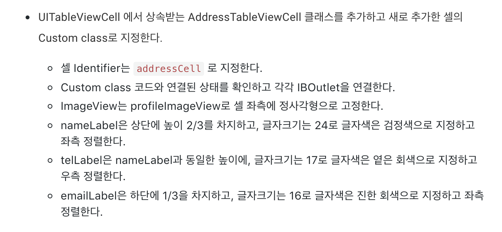
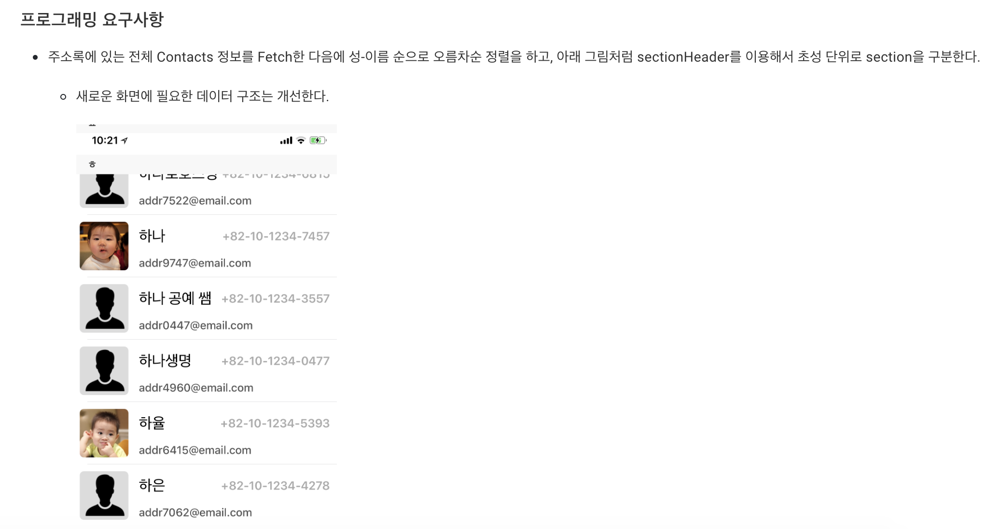
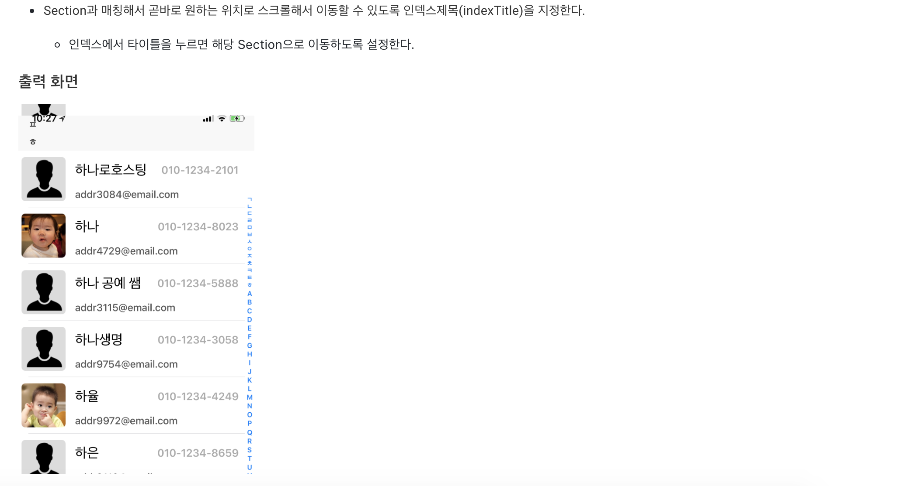
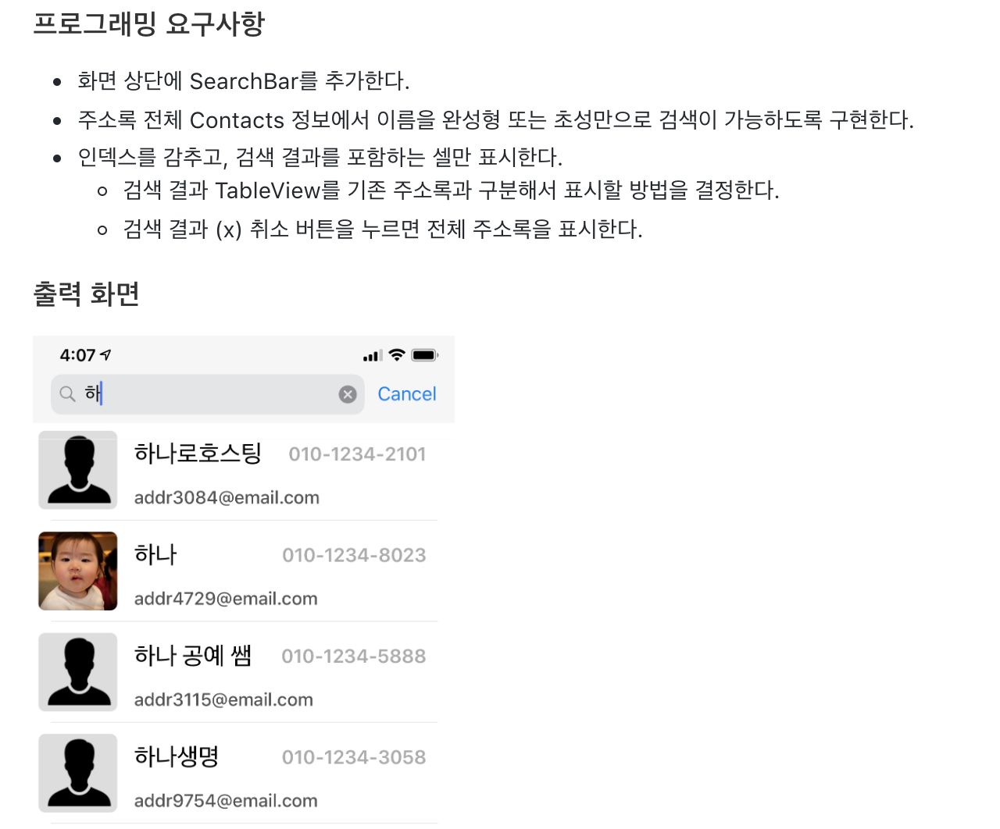

# swift-addressbookapp


### Step 1





* **Contact 프레임워크** 이용하여 주소록 데이터 가져오기
* 주소록 접근을 앱에서 허용하기 위해 info.plist수정으로 권한 얻기
* `CNContact` 정보 중 원하는 정보의 Formatting하기


**주소록 데이터 가져오기 위해 접근권한 허용**


 App에서 주소록 데이터에 접근하기 위해, Info.plist 파일의 다음과 같은 파일 추가가 필요하다.


**TableView 데이터 reloading해주기**

 이번 Step에서는 `TableViewController`를 이용하여 `TableView`를 디자인해주었다. 이전에 `UIViewController`를 이용했던 것과는 다르게 `TableViewController`를 이용하면 `DataSource`와 `Delegate`가 앱이 실행되면서 바로 등록이 되어있기 때문에, 모델을 세팅해주기도 전에 `DataSource` 에서 데이터를 가져와서 모델이 적용되지 않는 문제가 있었다.

 이를 해결하기 위해 `TableViewController` 를 옵저버로 등록하고 모델이 셋팅되고 난 후 `TableView`를  리로드할 수 있게 하였다.

```swift
class AddressBookViewController: UITableViewController {
  private var address: AddressModel = AddressModel()
    
  override func viewDidLoad() {
    super.viewDidLoad()
    NotificationCenter.default.addObserver(self, selector: #selector(reloadTableView), name: .setAddress, object: nil)
    // 모델이 셋팅된 것을 알기 위해 옵저버 등록
    
    MGCContactStore.sharedInstance.fetchContacts {                                            			self.address.set(information: $0)                                           		}
  }
  
  // 모델이 셋팅된 후 TableView 다시 리로딩
  @objc func reloadTableView() {
    self.tableView.reloadData()
  }
}

class AddressModel {
  private var information: [CNContact] = []
    
  func set(information: [CNContact]) {
    self.information = information
    NotificationCenter.default.post(name: .setAddress, object: nil)
    // 모델의 데이터가 세팅된 후 post로 옵저버에 알림
  }
}
```


**주소록 데이터 Fetch**

 여기서는 애플 개발자 문서에서 Contacts 관련 샘플 파일의 받아서 사용하였다. `MGContact` 관련 객체들이 있었다. 내용을 살펴보니 `Contact` 프레임워크를 활용하여 주소록관련 데이터를 다루는 메소드들이 있었다.

 여기서 주소록 데이터를 Fetch해오기 위해 `MGContactStore` 클래스의 메소드를 사용하였다. 

` func fetchContacts(_ completion: @escaping (_ contacts: [CNContact]) -> Void) `

을 이용하여 주소록의 모든 데이터를 가져왔다. 

 많은 메소드들이 있는데 보고 필요한 메소드를 사용하면 될 것 같다.

```swift
MGCContactStore.sharedInstance.fetchContacts { contacts in
	self.address.set(information: contacts)
}

// 정보를 저장하기 위한 모델
class AddressModel {
  private var information: [CNContact] = []
    
  func set(information: [CNContact]) {
    self.information = information
    NotificationCenter.default.post(name: .setAddress, object: nil)
  }
}
```


**주소록 데이터 Formatting**

 주소록 데이터의 타입이 다 다르기 때문에 String타입으로 사용하기 위해서는 별도의 Formatting이 필요하다.

```swift
// CNContact Name 정보 Formatting하기
func set(_ information: CNContact) {
  let fullName = CNContactFormatter.string(from: information, style: 		.fullName)
}
```

```swift
// CNContact PhoneNumber 정보 Formatting하기
// CNContact.phonenumbers 는 [] 어레이 타입이다.
// 그 중 첫번째 요소를 꺼낸후 value타입의 String 값이 필요하다.
let phoneNumber = information.phoneNumbers.first?.value.stringValue
```


**실행화면**


### Step 2





* 한글에서 초성, 중성, 종성 구하기
* `TableView` `Index Title` 활용해 원하는 `Section`으로 이동 


**유니코드 활용해 초성 구하기**

 한글은 유니코드에서 `0xAC00` ~ `0xD7A3` 사이의 코드 값을 가진다. 10진수로 변경해보면 `44032` ~ `55203` 사이의 값이다. 초성 19개, 중성 21개, 종성 28개로 만들 수 있는 한글자의 개수이다.

 이를 활용해서 초성, 중성, 종성을 구할 수 있다.

 **한글 유니코드 계산식 =((초성 * 21) + 중성) * 28 + 종성 + 0xAC00** —> 여기서 초성 중성 종성이란, 19개 21개 28개중 자신이 해당하는 인덱스이다.

 이 식에서 초성, 중성, 종성을 구하는 식을 유도할 수 있다.

 **초성 계산식 = (유니코드 - 0xAC00) / 28 / 21**

 **중성 계산식 = (유니코드 - 0xAC00) / 28 % 21 **

 **종성 계산식 = (유니코드 - 0xAC00) % 28**


 초성

| **ㄱ** | **ㄲ** | **ㄴ** | **ㄷ** | **ㄸ** | **ㄹ** | **ㅁ** | **ㅂ** | **ㅃ** | **ㅅ** | **ㅆ** | **ㅇ** | **ㅈ** | **ㅉ** | **ㅊ** | **ㅋ** | **ㅌ** | **ㅍ** | **ㅎ** |
| ------ | ------ | ------ | ------ | ------ | ------ | ------ | ------ | ------ | ------ | ------ | ------ | ------ | ------ | ------ | ------ | ------ | ------ | ------ |
| 0      | 1      | 2      | 3      | 4      | 5      | 6      | 7      | 8      | 9      | 10     | 11     | 12     | 13     | 14     | 15     | 16     | 17     | 18     |

중성

| **ㅏ** | **ㅐ** | **ㅑ** | **ㅒ** | **ㅓ** | **ㅔ** | **ㅕ** | **ㅖ** | **ㅗ** | **ㅘ** | **ㅙ** | **ㅚ** | **ㅛ** | **ㅜ** | **ㅝ** | **ㅞ** | **ㅟ** | **ㅠ** | **ㅡ** | **ㅢ** | **ㅣ** |
| ------ | ------ | ------ | ------ | ------ | ------ | ------ | ------ | ------ | ------ | ------ | ------ | ------ | ------ | ------ | ------ | ------ | ------ | ------ | ------ | ------ |
| 0      | 1      | 2      | 3      | 4      | 5      | 6      | 7      | 8      | 9      | 10     | 11     | 12     | 13     | 14     | 15     | 16     | 17     | 18     | 19     | 20     |

종성

|      | **ㄱ** | **ㄲ** | **ㄳ** | **ㄴ** | **ㄵ** | **ㄶ** | **ㄷ** | **ㄹ** | **ㄺ** | **ㄻ** | **ㄼ** | **ㄽ** | **ㄾ** | **ㄿ** | **ㅀ** | **ㅁ** | **ㅂ** | **ㅄ** | **ㅅ** | **ㅆ** | **ㅇ** | **ㅈ** | **ㅊ** | **ㅋ** | **ㅌ** | **ㅍ** | **ㅎ** |
| ---- | ------ | ------ | ------ | ------ | ------ | ------ | ------ | ------ | ------ | ------ | ------ | ------ | ------ | ------ | ------ | ------ | ------ | ------ | ------ | ------ | ------ | ------ | ------ | ------ | ------ | ------ | ------ |
| 0    | 1      | 2      | 3      | 4      | 5      | 6      | 7      | 8      | 9      | 10     | 11     | 12     | 13     | 14     | 15     | 16     | 17     | 18     | 19     | 20     | 21     | 22     | 23     | 24     | 25     | 26     | 27     |


 넘어온 문자열 중, 첫번째 글자의 초성 구하기

```swift
static func extractInitial(from string: String) -> String {
  let koreanInitial = ["ㄱ", "ㄲ", "ㄴ", "ㄷ", "ㄸ", "ㄹ", "ㅁ", "ㅂ", "ㅃ", "ㅅ", "ㅆ", "ㅇ", "ㅈ", "ㅉ", "ㅊ", "ㅋ", "ㅌ", "ㅍ", "ㅎ"]

  guard let firstCharactor = string.first else { return "" } 			// 첫번째 문자만 골라냄
  guard let charactorUnicode = firstCharactor.unicodeScalars.first else { return "" } // 첫번째 문자의 Unicode 값

  if charactorUnicode.value >= 44032 && charactorUnicode.value <= 55203 {		// 한글일 경우
    let index = (charactorUnicode.value - 0xAC00) / 28 / 21
    return koreanInitial[Int(index)]
  } else {
    return String(charactorUnicode)																					// 아닐 경우
  }
}
```


**Section Header 만들기**

 `UITableViewDelegate` 의 메소드인 다음 메소드를 구현해주어야 한다. 인자로 들어오는 section은 몇번 째 Section에 해당 Header를 사용할지 지정할 때 사용될 수 있다.

```swift
override func tableView(_ tableView: UITableView, titleForHeaderInSection section: Int) -> String? {
  return address.getGroupKey(at: section)
}
```


**Index Title활용 Section매칭**

 우선 IPhone을 사용하면서 자주 볼 수 있는 오른쪽에 인덱스를 생성하여야한다. 인덱스를 생성하기 위해선 `UITableViewDataSource` 의 메소드인 다음과 같은 메소드를 구현하여야한다.

 다음과 같이 구현하게 되면 A, B, C, D 순으로 클릭할 시 Section 0, 1, 2, 3으로 이동하게 된다.

```swift
override func sectionIndexTitles(for tableView: UITableView) -> [String]? {
  return ["A", "B", "C", "D"]
}
```

이를 제어하기 위해 `UITableViewDataSource` 의 메소드인 다음과 같은 메소드가 필요하다. 구현하게 되면 클릭한 `Index`, `title` 에 따라 이동할 Section을 지정해줄 수 있게 된다. 

```swift
override func tableView(_ tableView: UITableView, sectionForSectionIndexTitle title: String, at index: Int) -> Int {
  return address.getIndexBy(title)
}
```


**실행화면**


### Step 3



* SearchBar 활용
* 검색 기능 구현


**UISearchBar 활용**

 공부를 하면서 보았을 때, SearchBar를 사용하는 방법이 2가지가 있는 듯했다. 한가지는 `UISearchController` 를 이용하는 방법과 한가지는 `UISearchBar` 와 `UISearchBarDelegate` 를 이용하는 방법이다. 자세히 공부해보지는 않았지만 `UISearchController` 를 이용할 경우에는 결과를 다른 뷰로 보여주어야할 경우 이점이 있는 것 같았다.

 이번 스텝에서는 `UISearchBar` 와 `UISearchBarDelegate` 를 이용하여 기능을 구현하였다.


1. `UISearchBar` 을 MainStoryBoard에 추가해주었다.
2. `ViewController` 에 `IBOutlet` 으로 `UISearchBar` 을 연결해주었다.

 여기까지 하면 화면 상에 `UISearchBar` 가 나타나고 SearchBar의 옵션을 설정해줄 수 있게 된다. 하지만 아직 SearchBar를 통해 행동을 제어하지는 못한다.

 제어하기 위해선 `UISearchBarDelegate` 을 채택하고 구현한 class을 SearchBar의 delegate로 넣어주어야 한다.

3. SearchBar의 Delegate를 선택한다.

```swift
class ViewController: UITableViewController {
  @IBOutlet weak var searchBar: UISearchBar!
  
  override func viewDidLoad() {
    super.viewDidLoad()
    searchBar.delegate = self
  }
}

extension ViewController: UISearchBarDelegate {
}
```

 이제 SearchBar를 이용할 준비가 끝났다. 여기선 `UISearchBarDelegate` 의 메소드를 공식문서에서 확인해 필요한 기능을 구현해주면 된다.


**검색 기능 구현**

 앞에서 `UISearchBarDelegate` 의 메소드를 활용하여 구현하였다. 여러가지 메소드가 있는데 그 중 몇가지를 활용하였다.

 우선 `UISearchBar` 에 입력한 텍스트를 바탕으로 결과를 띄우기 위해 `func searchBar(_ searchBar: UISearchBar, textDidChange searchText: String)` 메소드를 활용하였다.

 이 메소드는 `UISearchBar` 에 입력된 값이 바뀔 때마다 불리는 메소드이다. 바뀌면 그 검색한 값에 따라 원본데이터에서 필터한 값을 화면에 띄우도록 구현하였다.

```swift
class ViewController: UISearchBarDelegate {
  var filteredAddress: [AddressDTO] = []
  
  func searchBar(_ searchBar: UISearchBar, textDidChange searchText: String) {
    filteredAddress = address.filterBy(searchText)
    tableView.reloadData()
  }
}
```

 이렇게 하면 검색창에 입력한 것에 따라 filter는 완료되었다. 이제 filter링 되지 않았을 경우를 구분하기 위해 Bool 값을 하나 선언해준다.

 입력할 때마다 false 일땐 `TableView DataSource` 에서 원본데이터를 표시할 수 있게 하고, true일 경우는 filter된 데이터를 표시할 수 있게 구현해주었다.

```swift
class ViewController: UISearchBarDelegate {
  var filteredAddress: [AddressDTO] = []
  var isSearching: Bool = false
  func searchBar(_ searchBar: UISearchBar, textDidChange searchText: String) {
    if searchText == "" {
      isSearching = false
    } else {
      isSearching = true
      filterdAddress = address.filterBy(searchText)
    }
    tableView.reloadData()
  }
}
```


 